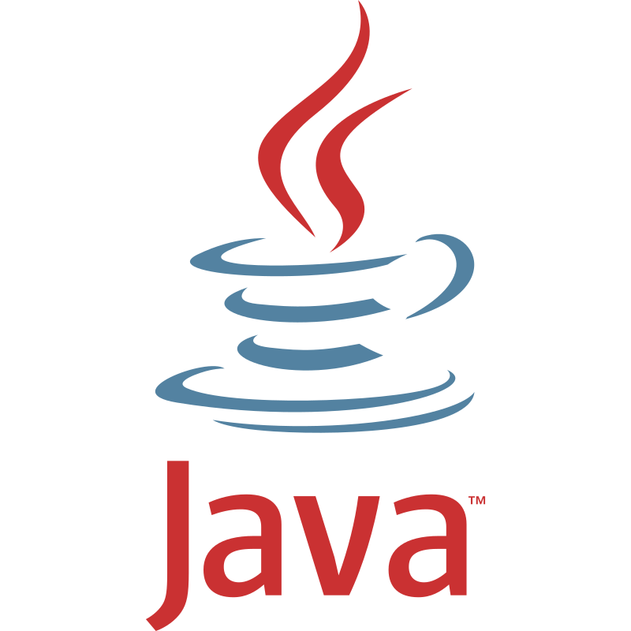
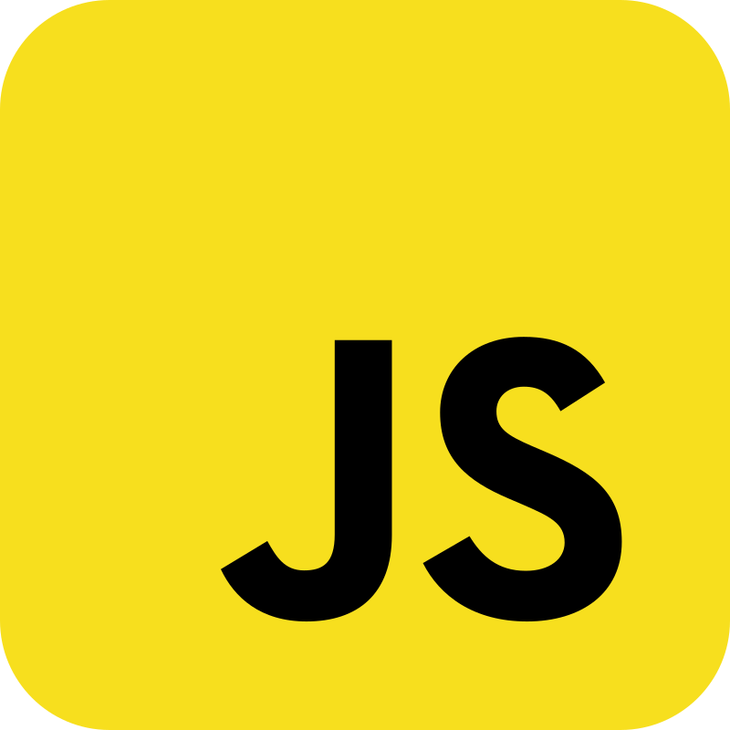
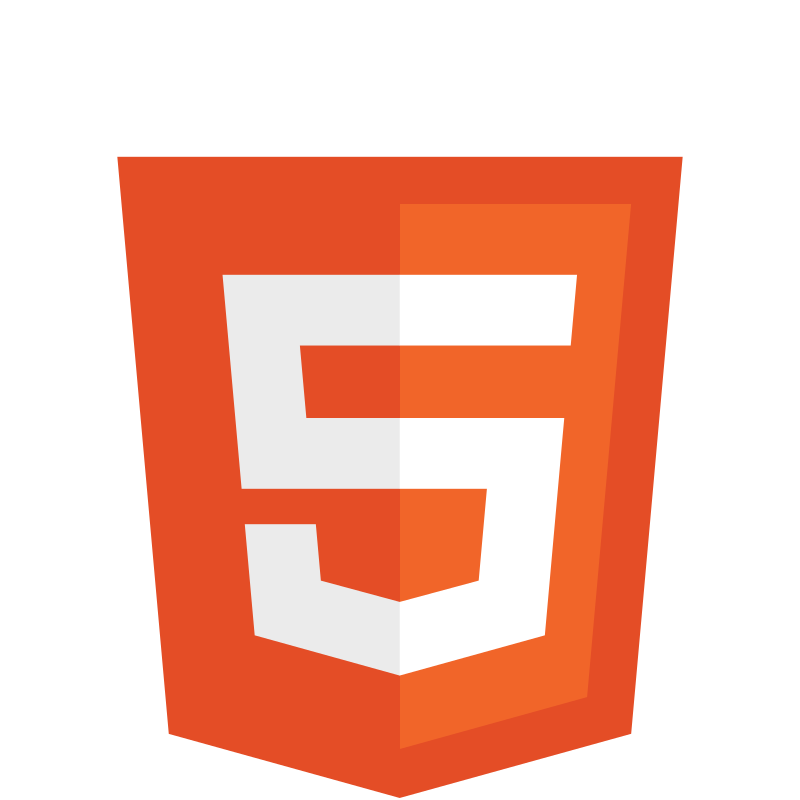
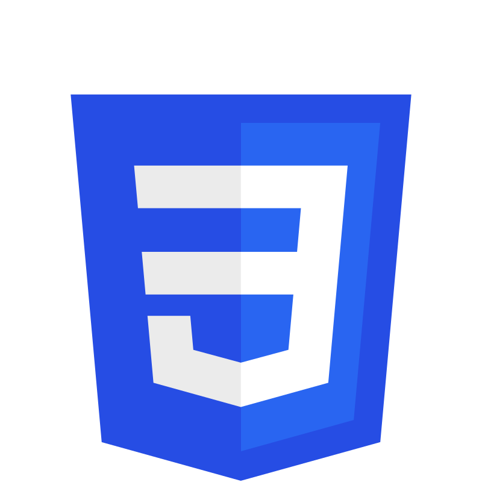
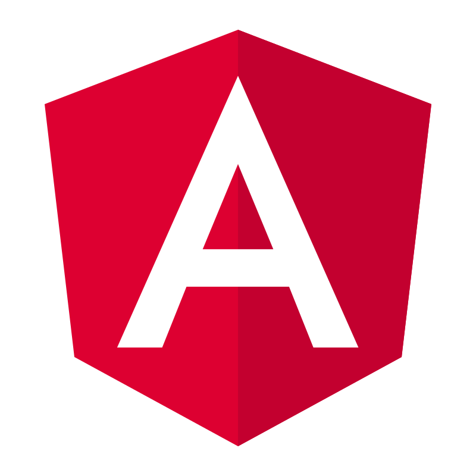
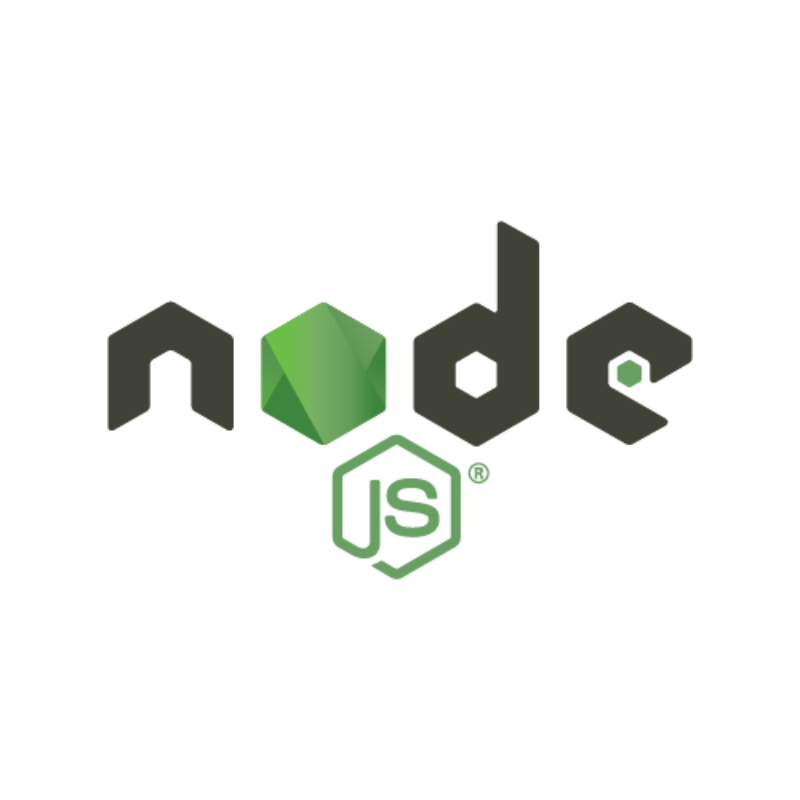

<h2>👋 Olá, eu sou o Felipe Boos</h2>

<h3 align="left">Sobre mim</h3>

Estudante de Ciência da Computação na FURB, atualmente na 5ª fase.  

Profissional com 3+ anos de experiência como <strong>Suporte Técnico N1</strong>, com foco em sistemas ERP e logística, resolvendo problemas reais de usuários e lidando com regras de negócio no dia a dia.  

Atualmente estou em transição para desenvolvimento, focado em backend e construção de sistemas completos, e busco minha primeira oportunidade como <strong>desenvolvedor júnior ou estagiário</strong>.  

## 📌 Projeto em destaque

Atualmente desenvolvo o <strong>PriceLab</strong> — um sistema fullstack de gestão de produtos com simulação de estratégias de precificação,
utilizando:   

<strong>- Java</strong> 
<strong>- Spring Boot</strong> 
<strong>- Banco de dados relacional (PostgreSQL)</strong> 
<strong>- Angular</strong> 
<strong>- Git</strong> 
<strong>- CI/CD</strong> 
<strong>- Migração e versionamento de banco de dados (Flyway)</strong> 
<strong>- Tratamento de exceções</strong> 
<strong>- Testes Unitários com JUnit e Mockito</strong>  

<h2 align="center">- Tech Stack -</h2>

<h3>Linguagens de Programação</h3>

    
    
    
    

<h3>Desenvolvimento Frontend</h3>

    
    
    
    

<h3>Desenvolvimento Backend</h3>

    
    

<h3>Bancos de dados</h3>

    
    

<h3>Outras competências</h3>

<strong>- CI/CD</strong> 
<strong>- Git & GitHub</strong> 
<strong>- Migração e versionamento de banco de dados (Flyway)</strong> 
<strong>- Tratamento de exceções</strong> 
<strong>- Testes unitários (JUnit e Mockito)</strong> 

<h3>Estudando atualmente</h3>

<strong>- Docker</strong> 
<strong>- Computação em nuvem</strong> 
<strong>- Autenticação com JWT</strong> 
<strong>- Arquitetura de software</strong> 

<h2>📫 Entre em contato comigo!</h2>

    
     
    
     
    

