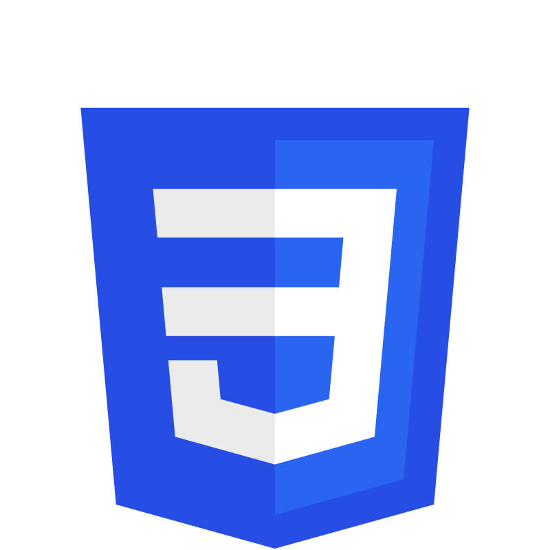

<h2>Olá, meu nome é Felipe. Seja bem vindo ao meu perfil!</h2>

Sou um estudante de Ciência da Computação na Furb, atualmente na quarta fase. Estou também complementando meu conhecimento com cursos na Alura e na Udemy.

Sou apaixonado por tecnologia e busco constantemente aprender e evoluir. Estou empolgado para utilizar os conhecimentos que adquiri com meus estudos para entregar soluções eficientes e de qualidade.

<h2 align="center">Meus stats</h2>

<h3>Linguagens de Programação</h3>

    
    
    
    

<h3>Desenvolvimento Frontend</h3>

    
    
    
    

<h3>Desenvolvimento Backend</h3>

    
    
  </a>

<h3>Bancos de dados</h3>

    

  

<!-- ** Imagens ficam com sublinhado quando utilizo o <a>, verificar para corrigir

<h3>Linguagens de Programação</h3>

  
  
  
  

<h3>Desenvolvimento Frontend</h3>

  
  
  
  
  
  

<h3>Desenvolvimento Backend</h3>

  
  

<h3>Bancos de dados</h3>

  

-->